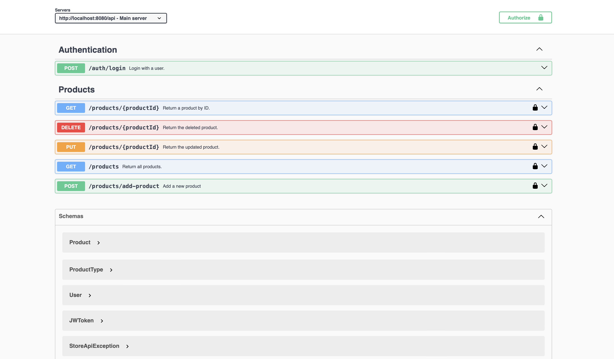

# StoreManagement API

## Tools used:
- [Springboot](https://spring.io/projects/spring-boot)
- [SpringData](https://spring.io/projects/spring-data-jpa)
- [Maven](https://maven.apache.org/download.cgi)
- [Lombok](https://projectlombok.org)
- [Postgresql](https://www.postgresql.org) 
- [OpenApi Maven Generator](https://openapi-generator.tech/docs/plugins/)
- [Mapstruct](https://mapstruct.org)

## How to run
1. Go to .project-config/.local-env and run `docker-compose up` to start the local environment (database)
2. Run in terminal `mvn clean install` to generate the classes from `openapi.yml` file from `src/main/resources/static`. This will generate the `ProductsApi` interface, the `ProductsApiController` class which implements `ProductsApi` and the `ProductsApiDelegate` which we implemented.
3. Start the application. The application runs on `localhost:8080` by default

## Documentation
We have access to the swagger-ui through [http://localhost:8080/swagger-ui/index.html?continue#/](http://localhost:8080/swagger-ui/index.html?continue#/) where we can see all endpoints and we can test them.

